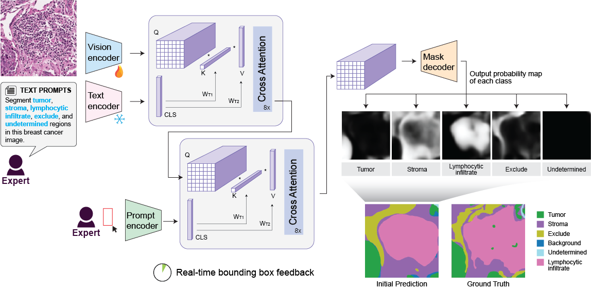

# VISTA-PATH: An interactive foundation model for pathology image segmentation and quantitative analysis in computational pathology

📎 **Paper Link**: <https://www.arxiv.org/abs/2601.16451>

🤗 **Model**: <https://huggingface.co/zhihuanglab/VISTA-PATH>

## 🔥 Overview

VISTA-PATH (Visual Interactive Segmentation and Tissue Analysis for Pathology) is an interactive foundation model for histopathology image segmentation that integrates visual context, textual class prompts, and expert-guided interaction. Pre-trained on over **1.6 million** samples, VISTA-PATH achieves strong segmentation generalization across organs and tissue types, supports efficient **human-in-the-loop** refinement, and enables **clinically interpretable analysis** through survival-associated morphological features.

## 🤖 Model Overview



Overview of VISTA-PATH model architecture


## 🎬 Demo Video

VISTA-PATH supports **human-in-the-loop** refinement by propagating sparse, patch-level bounding-box annotation feedback into whole-slide, pixel-level segmentation. VISTA-PATH is integrated into [TissueLab](https://www.tissuelab.org/). A step-by-step tutorial demonstrating how to perform VISTA-PATH active learning–based segmentation within TissueLab is available [here](https://github.com/zhihuanglab/VISTA-PATH/blob/main/notebook/run_TissueLab_VISTA-PATH.ipynb).

<a href="https://github.com/user-attachments/assets/401248f1-c57c-4bca-87d1-cea7d366002d">
  
</a>


## 🚀 Installation

First clone the repo (including the model checkpoint) and cd into the repo

```
git lfs install
git clone https://github.com/zhihuanglab/VISTA-PATH.git
cd VISTA-PATH
git lfs pull
```

Create a new enviroment with anaconda.

```
conda env create -f environment.yml
conda activate VISTA-PATH
```

Or install the same stack by hand:

```
conda create -n VISTA-PATH python=3.12
conda activate VISTA-PATH

pip install --extra-index-url https://download.pytorch.org/whl/cu128 \
    torch==2.10.0+cu128 torchvision==0.25.0+cu128
pip install transformers==4.46.1 tokenizers==0.20.3 huggingface-hub==0.36.2 \
    accelerate==0.26.0 safetensors==0.7.0
pip install openslide-python==1.4.6 openslide-bin==4.0.1.2 \
    opencv-python-headless==4.13.0.90 scikit-image==0.26.0 scikit-learn==1.8.0 \
    matplotlib==3.10.8 pillow==12.1.1 scipy==1.17.1 numpy==2.4.3
```

The OpenSlide C library comes from the `openslide-bin` wheel — the conda-forge
build fails at import with a libtiff/libjpeg symbol mismatch. Verify the
environment with:

```
python -c "import torch, openslide, transformers; print(torch.__version__, openslide.__library_version__)"
```

`conda env create` has been observed to under-install the pip section; if that
check fails, run the pip commands above inside the activated environment.

PLIP, Mask2Former and SAM are pulled from the HuggingFace Hub on first run.

## 🧠 Model Download

The VISTA-PATH model can be downloaded from the Hugging Face Hub

```python
from huggingface_hub import snapshot_download
snapshot_download("zhihuanglab/VISTA-PATH", local_dir="./checkpoints")
```

or straight from this repository (the checkpoint is tracked with Git LFS)

```
https://github.com/zhihuanglab/VISTA-PATH/tree/main/checkpoints/pytorch_model.bin
```

## 🔬 Quick Start: Model Inference  

put the checkpoint into the file ./checkpoints

### a. do inference without bbx

A whole-slide example is provided in `./examples/TCGA-COAD` for quick start

```
dataset_name=TCGA-COAD

python3 inference.py \
  --infer_vis_dir ./results/${dataset_name} \
  --checkpoint_file ./checkpoints/pytorch_model.bin \
  --image_dir ./examples/${dataset_name} \
  --class_names "Tumor" "Stroma" \
  --crop_size 2048 \
  --overlap 256 \
  --bbx_random 1
```

`--bbx_random` indicates to use bbx prompts or not, `1` means not using bbx, `0` means using bbx

`--image_dir` runs over every slide in a folder; use `--image_file` for a single slide. Pyramidal WSIs (`.svs`, `.ndpi`, `.mrxs`, `.tif`, `.tiff`) are read lazily through OpenSlide, so they are never loaded at full resolution; `.png`/`.jpg` ROIs are loaded into RAM.

`--crop_size` is in level-0 pixels and sets the field of view the model sees. The default of 1024 assumes 20x input (~0.5 um/px); the example slide is 40x, hence `--crop_size 2048`.

`--infer_vis_dir` saves final outputs. By default only `.jpg` is written, showing the raw image next to the segmentation mask. Add `--save_mask` to also write `.png`, the full-resolution label mask whose pixel values are the `--class_names` indices (starting at 1), and `--save_prob` to write `.npz` probability maps in the format `[class_name]: [probability map]`.


### b. do inference with bbx

Toy examples are provided in `./examples/BRCA` for quick start

```
dataset_name=BRCA

python3 inference_bbx.py \
  --infer_vis_dir ./results/${dataset_name} \
  --json_file ./idx_to_names/${dataset_name}.json \
  --checkpoint_file ./checkpoints/pytorch_model.bin \
  --image_dir ./examples/${dataset_name}/images \
  --mask_dir ./examples/${dataset_name}/masks \
  --bbx_random 0 
```

`--mask_dir` provides bbx prompts

`--json_file` provides class names

As above, only `.jpg` is written by default — one row per prompted class (image / predicted probability / ground truth) plus a merged row. Add `--save_mask` for the `.png` label mask and `--save_prob` for the `.npz` probability maps.

## 🌟 Acknowledgement

The project was built on top of repositories such as [PLIP](https://github.com/PathologyFoundation/plip) and [SAM](https://github.com/facebookresearch/segment-anything). We thank the authors and developers for their contribution.


## 📖 Publication

```
@misc{liang2026vistapath,
  title        = {VISTA-PATH: An interactive foundation model for pathology image segmentation and quantitative analysis in computational pathology},
  author       = {Liang, Peixian and Li, Songhao and Koga, Shunsuke and Li, Yutong and Alipour, Zahra and Tang, Yucheng and Xu, Daguang and Huang, Zhi},
  year         = {2026},
  eprint       = {2601.16451},
  archivePrefix= {arXiv},
  primaryClass = {cs.CV},
  doi          = {10.48550/arXiv.2601.16451},
}
```


